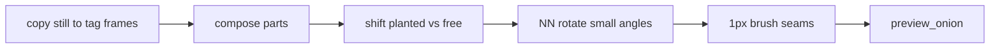

# Anim craft — кадр к кадру на 64–128

Канон циклов персонажа для DrawingManager. Кадр still и палитра — [`PIXEL_CRAFT.md`](PIXEL_CRAFT.md). Гибрид compose/shift/rotate/brush — [`refs/craft/hybrid-anim.md`](refs/craft/hybrid-anim.md). Карточки saint11 и SLYNYRD — расширение, не замена. Веб-галереи / FPS / walk-оси — [`refs/web-anim/README.md`](refs/web-anim/README.md) (открывать вместе с этим файлом перед тегом). Очередь качества — [`PLAN_CRAFT_NEXT.md`](PLAN_CRAFT_NEXT.md).

Плоские «пятна» и дёрганый луп ломаются **методом**, не размером холста. На 64–128 персонаж не едет **целым спрайтом без кисти**: кадр тега собирают из частей, швы доводят 1px.

Перед любым тегом кроме однокадрового `still` агент открывает этот файл, гибрид-карточку **и** [`refs/web-anim/README.md`](refs/web-anim/README.md) (оси галереи, не чужие пиксели).

---

## Limb-slide (запрет)

**Limb-slide** — сдать цикл как `copy_cels` + `shift_cel` **всего** спрайта (или тот же рисунок с глобальным `ox/oy`) **без кисти**: рука/нога телепортирует, край не стыкуется с прошлым кадром, сирота кричит в лупе.

Это не запрет копировать still как **черновик**. Запрет — **сдать** сдвиг без стыка.

На персонаже 64–128 copy+shift целого cel без кисти — не анимация. Saint11 Modular: куски можно двигать; **стык всегда кистью**. SLYNYRD Pixelblog 8: уважать кластеры **каждого** кадра.

| Можно | Нельзя |
| --- | --- |
| `copy_cels` still → кадры тега как черновик массы, затем части + кисть | Сдвинуть **весь** персонаж `shift_cel` и сдать |
| `shift_rect` 1–3px по части (горб, грудь, челюсть, хвост); копыта `plant` | Offset-still: «never redraws still», тот же спрайт + `by` без швов |
| `rotate_pixels` NN малых углов (±4…8°) вокруг сустава, не bilinear | Крутить весь холст 96×96 |
| Обязательная кисть 1px: дыры шеи/плеча/скакательного, sel-out, spec, веко | `copy_cels` + `shift_cel` как **финал** персонажа |
| `shift` / `copy` у **пропа** (`create_prop` motion) | Сдать кадр, где силуэт idle не качнулся (только FX-сироты) |
| `shift_cel` ≤1px на idle-микро **света** на `fx` (пыль, излом кромки) после уже сдвинутой массы | Кисть «моргание» вместо bob корпуса |

Пропы и тайлы: `shift` 1–2px и `copy` остаются валидны.

---

## Протокол тега (гибрид)

Пользователь по-прежнему пишет **«ок» на ключах** до полной краски цикла. Walk/run/attack не красить целиком без этого.

1. **Still.** Pass 2 на кадре 1 по PIXEL_CRAFT. Эталон массы и рамп.
2. **Copy.** `copy_cels` still → кадры тега на слоях `line` / `color` / `shade` / `fx`. Это черновик, не сдача.
3. **Compose.** Двигать **части**, не весь cel: горб / голова+рога / челюсть / хвост / ближняя нога / дальняя нога. Посадка: ступни/копыта `plant` не едут (`shift_rect` не захватывает полосу подошвы; Y plant — из силуэта этого персонажа).
4. **Сдвиг.** `shift_rect` 1–3px: дыхание — торс −1/−2 Y; челюсть лагает; хвост своей фазой.
5. **Поворот.** `rotate_pixels` NN, малые углы (рог/хвост ±4…8° вокруг черепа / базы хвоста). Inverse mapping. Не bilinear. Не вращать весь холст.
6. **Кисть обязательно.** Дыры на шее/плече/скакательном, sel-out, блик, веко. Без этого кадр не сдан — это и есть limb-slide.
7. **Onion.** `preview_onion` на каждый новый тег: край силуэта, не только палки.
8. **Keys / in-betweens.** Крупный жест (walk contact/down/passing/up) — новые позы: скелет, затем гибрид от still **или** перерисовка кластера. Copy только чтобы поймать длительность, затем трансформ+кисть (не обязательный `clear_cel` всего персонажа).
9. **Smear.** На быстрой дуге — **один** кадр цветовой дуги. Цвет = материал в движении, 1–2 тона, на `fx`. Карточки: SLYNYRD 9, saint11 MotionBlur.
10. **Loop seam.** Кадр N стыкуется с кадром 1 того же тега: объём, щели, кромка горба/подошвы.

Easing — **расстояние между силуэтами**, не равный сдвиг +2,+2,+2 (saint11 Easings). Ключи сильнее in-betweens.

`clear_cel` всего персонажа и покраска с нуля **разрешены**, но это не единственный легальный путь. Легальный финал = читаемый жест + кисть на швах. Copy still как draft → transform → brush — канон idle и мелкого дыхания.

---

## Idle / walk / run / attack / hurt

- **Idle.** Силуэт **должен** качаться: горб и грудь (bob 1–3px), не только веко/блик/пыль на `fx`. 4 кадра: down / inhale / lag / exhale. Челюсть и хвост лагают. Копыта/ступни стоят. Гибрид: copy still → `shift_rect` корпуса (без подошвы) → лёгкий `rotate_pixels` рогов/хвоста → кисть стыков.
- **Walk.** Contact → down → passing → up, зеркало второй ноги **с правкой оклюзии** (дальняя короче и темнее, не копия ближней). Ждать «ок» на ключах. Не красить walk, пока нет «ок».
- **Run.** 4 ключа × 2. Обязательна фаза «обе ноги в воздухе». Не ускоренная ходьба.
- **Attack.** Stance → (опц. smear) → impact hold → overshoot recover. Для игрока без длинного замаха.
- **Hurt / die.** Один extreme (сжатие, отлёт, пасть). Не `shift_cel` всего спрайта без кисти.

Кастом: `add_action(name, frames, description)` → поза ключей → «ок» → paint по этому файлу.

---

## Onion и приёмка лупа

Обязательный `preview_onion` (или GIF в headless, потом снова live):

- силуэт idle **качается** (горб/грудь), не прыгает дыркой и не стоит столбом с морганием;
- кластер материала не рассыпается в сирот;
- контакт с землёй не обведён и не скользит, если нога должна стоять;
- после NN-поворота нет рваного края без кисти.

Скрипт: `scripts/pixel_qa.py --anim` (цвета в силуэте + inter-frame flicker). Flicker ловит «оторвалась рука»: много одиночных смен цвета без связного пятна.

Сдача цикла: на ×1 читается роль; луп без телепорта конечностей; GIF не класть в `work/`.

---

## Слои

Pass 1 может копировать/двигать `skeleton` / `volume` между кадрами тега.

Pass 2 (paint):

1. Скопировать still-краску на кадр тега (`copy_cels` слоёв `line` / `color` / `shade` / `fx`).
2. Трансформ частей (`shift_rect`, `rotate_pixels`).
3. Кисть 1px по швам. Не сдавать сырой blit.

`clear_cel` на этих слоях + полная перерисовка кластеров — запасной путь для новой позы (keys walk), не единственный законный.

Скелет прятать, не удалять.

Шаблоны `lua/templates/creature.lua` и offset-still — черновик. Гибрид idle = copy still → части → кисть, не `paint_redraw_phase` одними сиротами. Не открывать закрытый пробник `demon_96`.
