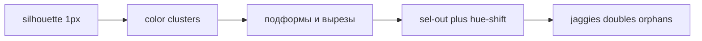

# Pixel craft — канон side-on

Канон языка рисования для DrawingManager. Хранится в репозитории, чтобы его было видно на любом ПК после `git clone`.

Проблема грубых спрайтов — не «мало пикселей на холсте». На 64×64 профессиональный side-scroller как раз должен выглядеть плотным. Ломается метод: прямоугольники, сетка 2px и автоматический контур.

Слои, теги, MCP: [`PLAN.md`](PLAN.md). Публичные референсы (вес линии, щели, свет — без чужих ассетов в `work/`): [`refs/sideon.md`](refs/sideon.md). Карточки saint11 (CC BY, GIF-гайды оцифрованы): [`refs/saint11/README.md`](refs/saint11/README.md). Правила агента: [`.cursor/rules/drawing.mdc`](../.cursor/rules/drawing.mdc).

Стиль по умолчанию — **строгий side-on**. Инструменты и слои называем как в коде: `volume`, `line`, `color`, `shade`, `fx`, `draw_pixels`, `pose_skeleton`, `paint_creature`.

---

## Целевой стиль

- **Вид.** Камера в плоскости персонажа. Ближняя нога и рука чуть ниже и правее (`facing` right), дальние — короче и темнее. Не ¾, не изометрия, пока пользователь не попросил иное.
- **Свет.** Один источник, **верх-лево**, если в чате не задано иное.
- **Линия.** **1px** на любом холсте персонажа 64–128. Кисть не масштабировать через `U()` / `S()`.
- **Палитра.** 2–3 тона на материал (база / тень / блик). Тень — hue-shift в холод, блик — в тёплый. Общий лимит ~8–16 цветов на персонажа даже внутри бандла `A64` / `EDG32`.
- **Контур.** **sel-out**, тонированный (затемнённый тон материала, не чистый `#000` кроме UI). Внутренние линии только там, где не хватает контраста двух пятен.
- **Силуэт.** Тест «заливка чёрным на 1 секунду»: плащ, капюшон, оружие, уши/рога читаются без цвета.
- **Negative space.** Щели между плащом и спиной, между оружием и головой, между ног. Без щелей силуэт — один blob.

Сложность — не «больше пикселей», а **подформы**: у плаща 2–3 складки, у черепа глазница + скула + зубы, у молота боёк / проушина / обмотка. Один «геройский» акцент (оружие, рога, уникальный шлем), остальное тихо.

---

## Почему текущий пайплайн даёт «толсто»

Ориентиры в коде (не копировать как финальную покраску): [`lua/templates/creature.lua`](../lua/templates/creature.lua), [`lua/templates/skeleton_cloak.lua`](../lua/templates/skeleton_cloak.lua).

- **Сетка 2px.** `U() = floor(size/32)` на 64×64 даёт 2. `S(n) = n * U()`. Рука `S(2)` = 4px, голова `S(8)` = 16px-квадрат. Деталей некуда ставить.
- **Язык = `draw_rect` / залитый эллипс.** Форма = кирпичи. Нет кластеров, вырезов, перекрытий.
- **Bresenham в `DM.draw_line` / `draw_line`.** На диагонали два пикселя касаются ребром (**doubles**) — линия толстеет.
- **`outline_from_volume` / `add_outline`.** Обводит каждый 4-связный край `volume` чёрным. Это комикс-обводка + pillow, не pixel outline.
- **Shade.** Вертикальная полоска вдоль края прямоугольника, без единого света и hue-shift.
- **Volume-блобы как финал.** Проход 1 (`pose_skeleton`) имеет право быть грубым. Проход 2 (`paint_creature`) не должен обводить те же блобы цветом.

Pass 1 = каркас позы. Pass 2 = отрисовка поверх по инвентарю форм.

---

## Инвентарь форм (до пикселей)

Перед любым `draw_rect` / `draw_ellipse` / заливкой — список подформ. Не «голова, торс, рука», а детали, которые займут пиксели.

Пример для скелета 64×64 в плаще (тот же принцип — для любого существа):

- капюшон: обод + полость
- череп: свод, глазница с глубиной, скула, челюсть, 2–3 зуба
- 4–5 рёбер как *щели*, не как палки поверх прямоугольника
- позвоночник 1px
- таз-крылья
- бедро / голень / стопа (не столбик)
- ближняя и дальняя рука (оклюзия: дальняя короче, темнее, частично закрыта)
- молот: боёк, обух, проушина, древко, обмотка
- плащ: 2–3 вертикальные складки + низ зубом, не прямоугольник

Шаблон для нового заказа: выписать 8–15 подформ в чате (или в sidecar), отметить один акцент и 2–4 обязательные щели. Потом рисовать.

---

## Протокол прохода 2 (после «ок» по позе)

`volume` прохода 1 можно оставить толстым и невидимым как подсказку. Краска идёт на `line` / `color` / `shade` / `fx` **поверх**, по инвентарю, а не обводкой блобов. Скелет: `set_layer_visible(..., "skeleton", false)` — не удалять.

1. **Silhouette lock.** Один цвет, край 1px, дырки в силуэте (глазницы, межрёберье, щель плаща, просвет между ног). Проверка `preview_sprite` на нативном размере и при сильном увеличении (×8 в live).
2. **Local palettes.** Для каждой зоны 3 hex из палитры заказа: кость, ткань, металл, пустота глазниц, кожа, листва и т.д. Не раскидывать весь `A64` по спрайту.
3. **Cluster paint** (слой `color`). Крупные заливки по силуэту (материал = связный кластер одного цвета), затем дробить кластеры на меньшие. Не добавлять сирот.
4. **Form light** (слой `shade`). Тень снизу-справа объёмов, блик сверху-слева. Ткань: длинные складки. Кость / хитин: жёсткий перелом. Металл: маленький жёсткий блик + тёмная кромка. Не полоса вдоль левого края каждого rect.
5. **Sel-out** (слой `line` + правка `color`). Снять обводку на свету (верх-лево) — там пиксель тела. Оставить тёмную кромку на низе и на стыке с фоном. Не обводить подошвы и хват оружия / контакт с землёй.
6. **Suggest, don’t draw everything.** Внутренние линии короткие: скула, край капюшона, проушина, шов. Не клетка вокруг каждого под-объекта.
7. **Polish.** Убрать doubles; выровнять ступени кривых (на прямой — одинаковые, на кривой — монотонно растут/убывают, например 5-2-2-1-1, не 5-2-1-2-1); orphan только как глаз / блик / зуб; без banding.
8. **Read at 100%.** Если на нативном размере деталь слипается — удалить, не «уточнять» на ×8.

Кластер = связная группа пикселей одного цвета. Слабые диагональные касания кластера лучше не копить. Одиночный пиксель (orphan) = шум, кроме 1–2 акцентов.

---

## Запреты агенту

- Не использовать `S()` / `U()` для покраски персонажа (проход 2, слои `line` / `color` / `shade` / `fx`). Кисть 1px на 64–128.
- Не вызывать `outline_from_volume` и не сдавать `add_outline` как финальный контур.
- Не заполнять конечности прямоугольниками шире **2px рука / 3px нога** на холсте 64. На 96–128 конечности чуть толще, но не «столбы».
- Не красить `shade` полосой вдоль левого края каждого `draw_rect`.
- Не копировать пиксели из игр в `work/`. Референс — анализ в [`refs/sideon.md`](refs/sideon.md).

`draw_rect` / `draw_ellipse` допустимы в проходе 1 (`volume`) и как черновая масса, которую сразу режут вырезами. Финальный край — кластеры и 1px линия с диагональным касанием сегментов, не 4-связная чёрная рамка.

---

## Антипаттерны

| Имя | Как выглядит | Что делать |
| --- | --- | --- |
| **Pillow shading** | Тень по всему периметру, светлый центр | Один свет верх-лево; тень снизу-справа |
| **Doubles** | Два пикселя контура касаются ребром на диагонали | Сегменты линии стыковать **по диагонали**; подчистить лишний пиксель |
| **Jaggies** | Ступени кривой скачут (3-1-3) | На прямой — равные ступени; на кривой — рост/спад без дыр в ряду |
| **Banding** | Ровные кольца тени вокруг формы | Сжать пояса, сменить направление градиента, hue-shift; не концентрические обводки |
| **Noise** | Сильный dither, россыпь сирот | Крупные кластеры; orphan только глаз/блик/зуб |
| **Сетка 2px** | Все размеры кратны `U()` | Покраска в координатах спрайта, 1px |
| **Автоконтур** | Чёрная 4-связная обводка всего `volume` | sel-out вручную; дырки и контакты без линии |
| **Blob-финал** | Pass 2 = цветные прямоугольники pass 1 | Инвентарь форм, вырезы, щели |

AA (1px midtone на длинной лестнице) — по желанию, в конце, когда известен фон. На 64 по умолчанию выкл.: легко размывает силуэт. Не AA на 45° (ступень 1×1) и не наружу спрайта в прозрачность.

---

## Слои и инструменты

Стек не меняется ([`PLAN.md`](PLAN.md)):

- простое существо: `skeleton` → `volume` → `line` → `color` → `shade` → `fx`
- сложное: группы `skeleton` / `volume` / `paint`

После «ок»: прятать `skeleton`, не удалять. Старый смысл «силуэт» = `volume` только как каркас.

Рисовать через MCP: `draw_pixels` (основной 1px), `draw_polyline` / `draw_line` (потом снять doubles), `fill_area` для кластера, `clear_cel` если надо начать слой заново. `run_lua` — тот же язык, без `S()`/`U()` в финальной краске.

Пропы и тайлы: тот же свет и 1px край, где есть контур. Крупная мебель может остановиться на `volume` (как в плане 1.0) — тогда это блок-аут, не «готовый пиксель».

---

## Приёмка кадра

- На ×1 читаются роль и 2–4 подформы (для скелета: капюшон, глазницы, складки плаща, форма молота).
- На ×8 нет 2px-контура вокруг всего тела, нет doubles на длинных диагоналях, нет кольца pillow.
- Силуэт проходит чёрный тест; щели на месте.
- Цветов на персонаже мало; тень холоднее базы, блик теплее.

Исходник — `.aseprite` в `work/`, не PNG из `preview/`.

Расширение по темам (огонь, металл, walk, контур, idle/attack timing): карточки [`refs/saint11/cards/`](refs/saint11/cards/) и сводка [`refs/saint11/LEARNINGS.md`](refs/saint11/LEARNINGS.md). Канон этого файла не дублировать.

Дополнительно к тегам, не вместо pass 2: idle — bob 1px и лицо лагает за силуэтом; attack игрока — без замаха, первый кадр уже удар; squash сохраняет массу; металл почти не squash. Не масштабировать готовый спрайт — перерисовать (карточка Resizing). Даль локации тусклее и холоднее переда (Parallax).
