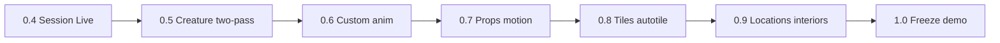

# DrawingManager → 1.0

Канонический план реализации. Хранится в репозитории (`docs/PLAN.md`), чтобы его было видно на любом ПК после `git clone`.

Мост не переписываем. Наращиваем Lua в [`lua/lib/dm.lua`](../lua/lib/dm.lua), шаблоны в [`lua/templates/`](../lua/templates/), MCP в [`mcp/ops.py`](../mcp/ops.py) + [`mcp/tools/__init__.py`](../mcp/tools/__init__.py), правила в [`.cursor/rules/drawing.mdc`](../.cursor/rules/drawing.mdc). Стиль по умолчанию **side-on**. Канон пикселя (кластеры, 1px, sel-out): [`PIXEL_CRAFT.md`](PIXEL_CRAFT.md). Публичные референсы (вес линии, щели, свет — без чужих ассетов в `work/`): [`refs/sideon.md`](refs/sideon.md). Заказы только в чате Cursor. Aseprite — **live-просмотр**.

Aseprite не делает Spine-деформацию: «скелет» = позовый каркас на слоях. После прохода 1 агент **останавливается** и ждёт «ок» / правок в чате.

Произвольные анимации: имя тега + **любое число кадров** (атака 10 или 15) + **текстовое ТЗ** («смерть: превращение в шарик, который лопается»). Дефолты 8 циклов — только если пользователь не задал иное.

Движение окружения — выбор пользователя на каждый проп: `shift` (сдвиг 1–2 px), `copy` (клон предыдущего кадра и правка), `redraw` (новый слайд с нуля).

Исходники: `work/characters/`, `work/nature/`, `work/interiors/`, `work/tilesets/`, `work/locations/`. Рядом с `.aseprite` — sidecar `.json` (теги, кадры, ТЗ анимаций, motion mode).

---

## Слои (снизу вверх)

- **Существо простое:** `skeleton` → `volume` → `line` → `color` → `shade` → `fx`
- **Существо сложное:** группа `skeleton` (`sk_spine`, `sk_head`, `sk_arm_f/b`, `sk_leg_f/b`, опц. хвост/оружие) → группа `volume` (`vol_*`) → группа `paint` (`line`, `color`, `shade`, `fx`)
- **Проп статичный / интерьер:** `volume` → `line` → `color` → `shade` → `fx` (крупная мебель: стоп после `volume`)
- **Проп живой:** то же + опц. `skeleton` у ткани/пламени; тег `loop`
- **Тайлсет:** `_unused` скрыт → `ground` tilemap-каталог
- **Локация:** `sky` → `ground` (tilemap) → `nature` → `furniture` → `characters`

После согласования `skeleton` не удаляем: `visible=false`. Старый `silhouette` = `volume`. `create_character_rig` остаётся быстрым черновиком; боевой путь — два прохода.

Дефолтные теги (переопределяются): idle 4×200мс, walk 8×100, run 8×80, attack 6×90, jump 3×80, fall 3×100, hurt 4×100, die 6×120.

---

## Pixel craft

Язык рисования — не размер холста. На 64–128 персонаж рисуется **1px** линией, цветовыми кластерами, sel-out и щелями в силуэте. Проход 1 (`pose_skeleton`) может быть грубым `volume`. Проход 2 (`paint_creature`) не обводит блобы и не масштабирует кисть через `U()` / `S()`.

Полный канон, алгоритм агента и антипаттерны: [`PIXEL_CRAFT.md`](PIXEL_CRAFT.md). Разбор публичных side-on референсов: [`refs/sideon.md`](refs/sideon.md). GIF-гайды saint11 (CC BY, оцифровка): [`refs/saint11/README.md`](refs/saint11/README.md).

---

## MCP-инструменты 1.0

Примитивы рисования не трогаем.

**Сессия / палитра**

- `apply_user_palette`: бандл / `.gpl` / hex / **`.aseprite`** (копия `palettes[1]`).
- `extract_palette(path)` — hex-список из спрайта.
- `set_layer_visible(path, name, visible)`
- `add_layer_group(path, name)`

**Существа / анимации**

- `create_creature(path, width, height, facing, complex, palette, tags?)` — `tags` = `{name, frames, ms, description?}`. Нет списка → дефолт 8 циклов.
- `pose_skeleton(path, tag?, description?)` — палки + volume.
- `paint_creature(path, tag?)` — проход 2 после «ок».
- `add_action(path, name, frames, description, ms?)` — кадры в конец, тег, sidecar.
- `copy_cels`, `shift_cel`, `clear_cel`

**Пропы**

- `create_prop(path, kind, width?, height?, frames, motion)` — `motion` ∈ `shift|copy|redraw`.
- Природа: tree, bush, grass, water, rock, cloud, fire, flag, torch, smoke.
- Интерьер: wall, floor, door, window, table, chair, chest, bed, banner.

**Тайлы / локация**

- `create_tileset(path, tile_size, theme, autotile)` — размер 16|32|64.
- `preview_tileset_seams(path)`
- `assemble_location` со слоем `furniture`, `theme` (meadow / interior_wood / dungeon / …); `stamp_onto`.

**Протокол агента:** нет размера/палитры → не рисовать; нет live → попросить Connect; после `pose_skeleton` — стоп до «ок». GIF: временно headless.

---

## Этапы

### 0.4 — сессия и live

Live по умолчанию, бриф, палитра из `.aseprite`, группы слоёв, sidecar JSON, правила.

### 0.5 — существо, два прохода

`create_creature` / `pose_skeleton` / `paint_creature`, слои skeleton/volume/paint, complex-группы.

### 0.6 — произвольные анимации

`add_action` с N кадров и текстовым ТЗ, override длины тегов, `copy_cels`.

### 0.7 — пропы и режимы движения

`create_prop` + `shift|copy|redraw`; fire/flag/torch/smoke; интерьеры.

### 0.8 — тайлы и автотайл

16/32/64, темы, blob-автотайл, швы.

### 0.9 — локации

`furniture`, штампы, демо поляна + интерьер.

### 1.0 — заморозка

`scripts/demo_v1.py`, README, стабильная поверхность MCP.

---

## Статус

Реализовано в репозитории (демо: `python scripts/demo_v1.py`). Поверхность MCP 1.0 заморожена — новые инструменты только с bump минорной версии.

## Вне скоупа 1.0

Экспорт в движок (PNG atlas, JSON для Unity), Spine-кости, GUI-плагины кроме live-extension, правка runtime `Aseprite/`.
