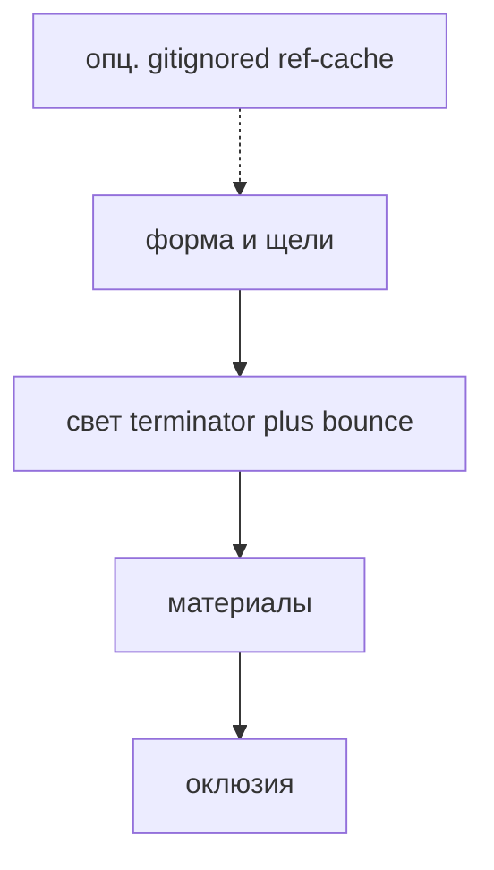

# Следующий цикл craft (после hybrid idle)

Не раздувает [`PIXEL_CRAFT.md`](PIXEL_CRAFT.md) / [`ANIM_CRAFT.md`](ANIM_CRAFT.md). Это **очередь обучения и приёмки**, чтобы персонаж 64–128 читался плотным: форма, свет, материал — ощущение референса вроде Nano Banana 2, путь — **1px native в Aseprite через MCP**. ИИ-картинку в `work/` не вклеивать.

Гибрид кадров уже в каноне: [`ANIM_CRAFT.md`](ANIM_CRAFT.md), [`refs/craft/hybrid-anim.md`](refs/craft/hybrid-anim.md). Чеклист осей: [`refs/craft/cycle-b.md`](refs/craft/cycle-b.md). Веб-учёба (Pixnote/Lospec): [`refs/web-anim/README.md`](refs/web-anim/README.md).

---

## 1. Форма, не шум

- Cluster sketching **до** 1px: крупные пятна, потом вырезы.
- Чёрный тест + на 96 ×1 читаются роль и **4–6 подформ** (не две кляксы).
- Щели: плащ/спина, рог/горб, между ног. Без щели силуэт — blob.
- Текстура 2–8 px, зоны отдыха без шума ([`refs/craft/texture-rest.md`](refs/craft/texture-rest.md)).

---

## 2. Свет как у «богатой» генерации

Словарь уже есть: [`refs/craft/light.md`](refs/craft/light.md).

- **Terminator + bounce** на каждом крупном объёме (горб, череп, бедро), не пояс вдоль контура.
- Proof: сфера **~32px** тем же бандлом, что крупный объём персонажа (верх-лево). Если сфера плоская — рампы мало; править still, не фильтр.
- Hue-shift: тень в холод, блик в тёплый. Не один hex на шкуру.

---

## 3. Материалы

На звере с несколькими материалами развести (не один пояс на всё):

| материал | грань | блик |
| --- | --- | --- |
| шкура | мягкий terminator | короткий, тёплый |
| рог (кератин) | жёсткие ступени | узкий, почти не squash |
| мокрая пасть | полость + 1–2 px spec на `fx` | wet, не металл |
| копыто | скол кластера, грязь | матовый + пыль |

Жёсткость грани и **длина** блика отличают материал сильнее, чем новый hex.

---

## 4. Оклюзия

Дальняя конечность: короче, на ступень темнее и **перекрыта** ближней массой. Не второй контур той же длины. Side-on: ближняя чуть ниже и правее (`facing` right).

---

## 5. Референс-only (опционально)

Nano Banana / Gemini (и любой ИИ-рендер) — **поза и свет**, не пиксель.

- Кладём промпт/PNG в gitignored [`_ref-cache/`](../_ref-cache/) (не в `work/`, не в `preview/` как сдачу).
- Агент **перерисовывает** 1px кластерами по PIXEL_CRAFT. Не импорт PNG в `.aseprite`: ломает сетку и канон ([SpriteCook: sub-pixel «пиксель»](https://www.spritecook.ai/blog/nanobanana-pixel-art-for-games)).
- Чужие игровые спрайты по-прежнему запрещены.

---

## Не делать в этом цикле

- 3D-to-pixel пайплайн как финал.
- Копировать кадры из игр в `work/`.
- Paste ИИ-PNG как готовый спрайт.
- Walk / run / attack без «ок» на ключах.
- Limb-slide: copy+shift целого спрайта **без кисти**.
- Bilinear-поворот, кручение всего холста 96.

---

## Очередь (следующий персонаж)

Пробник `demon_96` **закрыт** — не дописывать idle/walk и не править still. Следующий заказ = новый `create_creature`. На нём же:

1. Hair / cloth overlap (плащ, грива: лаг 1 кадр, щель vs тело).
2. Quadruped walk (копыта contact/down/passing/up, оклюзия дальней ноги) — [`refs/web-anim/quadruped.md`](refs/web-anim/quadruped.md).
3. Punches / melee (этап 33 старого разбора SLYNYRD): smear на `fx`, не mid-limb.

Сфера 32px + крупный объём still — парный proof света на **новом** персонаже.

Журнал изучения галерей: [`refs/web-anim/study-log.md`](refs/web-anim/study-log.md).
