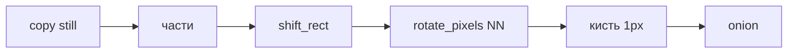

# Гибрид кадра (compose → shift → rotate → brush)

Когда: любой многокадровый тег персонажа 64–128, особенно idle. Канон: [`ANIM_CRAFT.md`](../../ANIM_CRAFT.md). Оси галерей: [`../web-anim/README.md`](../web-anim/README.md). Saint11 Modular: куски едут, **стык кистью**.

Limb-slide = copy+shift **целого** спрайта и сдача **без кисти**. Copy still как черновик — нормально.

## Части (side-on, facing right)

Не двигать один cel целиком. Режут окна:

| часть | что едет | что стоит |
| --- | --- | --- |
| горб / грудь | дыхание ±1…2 px по Y | — |
| голова + рога | почти как грудь | — |
| челюсть | лаг 1 кадр / +1 Y | — |
| хвост | своя фаза + лёгкий поворот | база у крупа |
| ближняя / дальняя нога | бедро с корпусом | **копыто plant** |
| веко / spec | кисть, не единственное движение | — |

Ступни/копыта: не включать plant-полосу в `shift_rect` (Y — по силуэту этого кадра). Подошву не обводить.

## Сдвиг и поворот

- `DM.shift_rect(layer, frame, x, y, w, h, dx, dy)` — вырезать окно, вставить со сдвигом. Клип к спрайту. Целый слой по-прежнему `shift_cel`.
- `DM.rotate_pixels(layer, frame, cx, cy, angle_deg, radius)` — nearest-neighbor, inverse mapping, только непрозрачные в радиусе вокруг пивота. Углы малые (±4…8°). Не bilinear. Не крутить весь 96×96.
- После NN край **всегда** рваный: кисть обязательна (sel-out, doubles, посадка).

## Кисть (сдача)

Без этого кадр не сдан:

- дыры шеи / плеча / скакательного;
- короткий sel-out на новом крае;
- spec / веко по фазе;
- восстановить plant-копыто, если сдвиг наехал на венчик.

## Idle

Силуэт **должен** bob (горб/грудь). Веко и пыль на `fx` — вторично. 4 кадра: down → inhale → lag → exhale. Луп: кадр 4 к кадру 1 без скачка горба.

## Для DM

- Слои paint: copy still → трансформ **тех же** `line`/`color`/`shade`/`fx` → кисть. Не `clear_cel` всего персонажа как единственный путь.
- `preview_onion` + `scripts/pixel_qa.py --anim`.
- Walk/run — после «ок» на ключах, тем же гибридом (или перерисовка ключа с нуля, если поза новая).
- В `work/` не вклеивать ИИ-PNG и чужие игровые кадры.
